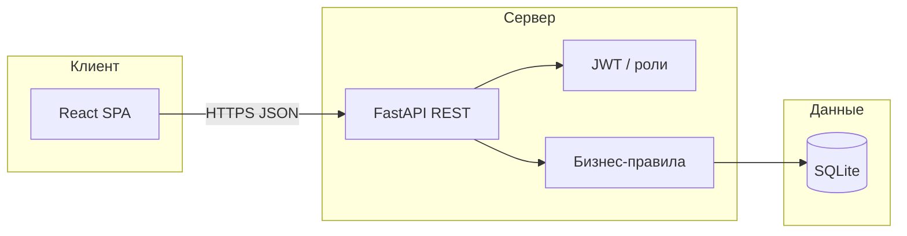
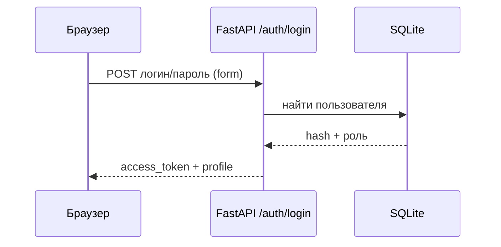
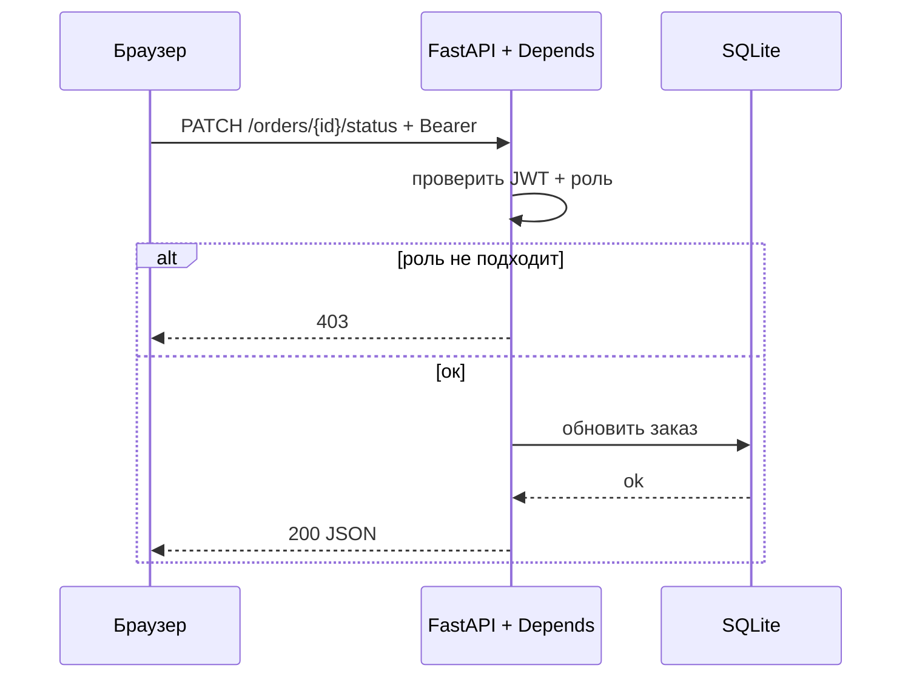
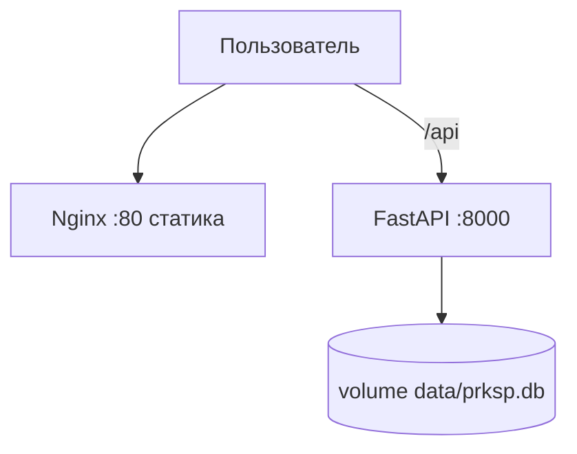

# Архитектура и UML (как оформить графику)

Ниже — заготовки под диаграммы. В отчёт обычно вставляют экспорт из PlantUML, draw.io или StarUML. Для быстрого превью можно открыть Mermaid в VS Code / на GitHub.

## 1. Компоненты (client–server)

## 2. Последовательность: логин

## 3. Последовательность: операция с проверкой роли

## 4. Деплой (Docker)

